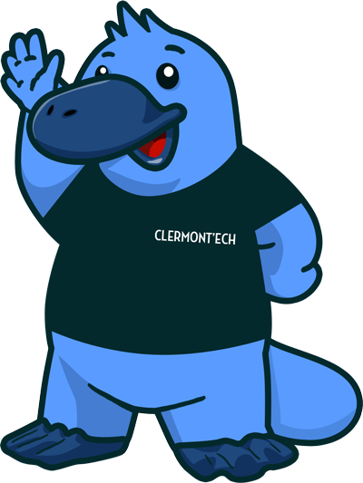
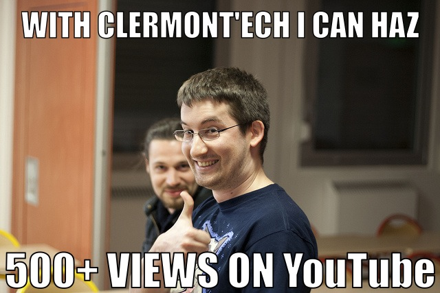
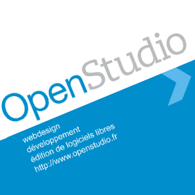
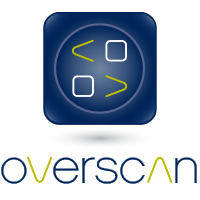

<!--
Titre : Introducing APIHours
Date : 17/12/2013
Événement : APIHour #6
Auteur : Julien Maupetit
-->

##### Clermont'ech fait son
# APIHour #6
## Xmas Edition

### 17/12/2013 • Le Celtill

[@clermontech](https://twitter.com/clermontech)

[clermontech.org](http://clermontech.org)

`#APIHour`

clermontech(2)

----
<!-- ---------- Section ---------- -->
# #APIHour

---
## #APIHour

* 4 talks
* 1h max.
* 50 personnes max.
* Lieu et jour variables
* Vidéos en ligne
* Fréquence : 6/8 semaines

---
## #APIHour
... is the new Happy Hour

    Crédit : <a href="http://thenounproject.com/noun/beer/#icon-No12254" target="_blank">Beer</a> designed by <a href="http://thenounproject.com/jacob" target="_blank">Jacob Halton</a> from The Noun Project

---
## #APIHour

Proposez nous un talk !

<a href="mailto:iwanttospeak@clermontech.org">iwanttospeak@clermontech.org</a>

---
## Be famous!

[@madmatah](https://twitter.com/madmatah) +300 vues sur YouTube en moins de 48h

----
<!-- ---------- Section ---------- -->
# Manifesto

---
# Partage

---
# Ouverture

Clermont'ech est technologie-agnostique.

---
# Indépendance

Clermont’ech ne se verra jamais dicter sa ligne éditoriale par des tiers extérieurs à l’association.

---
# Respect

    Crédit : <a href="http://thenounproject.com/noun/handshake/#icon-No767" target="_blank">Handshake</a> designed by <a href="http://thenounproject.com/Jake_Nelsen" target="_blank">Jake Nelsen</a> from The Noun Project

<!-- ---------- Section ---------- -->
----
# Sponsors!

<table>
    <tr>
        <td>
            
        </td>
        <td>
            
        </td>
        <td>
            
        </td>
        <td>
            
        </td>
        <td>
            
        </td>
        <td>
            
        </td>
        <td>
            
        </td>
        <td>
            
        </td>
        <td>
            
        </td>
        <td>
            
        </td>
    </tr>
</table>

---
# Goodies!

### Stickers, Cartes de visite,
## CHOCOLATS !
### Boutique spreadshirt

[http://clermontech.spreadshirt.fr](http://clermontech.spreadshirt.fr)

---
# Sweeties!

### "Choco Sinok"
## &
### Buffet préparé par le Celtill

<!-- ---------- Section ---------- -->
----

# Platydex

[http://github.com/clermontech/platydex](https://github.com/clermontech/platydex)

<!-- ---------- Section ---------- -->
----
## Menu du jour

Varnish, Un Serveur De Cache HTTP
#### Mickaël Gervais

L’Internet Des Objets Par L’Exemple
#### Paul Pinault

LINQ
#### Frédéric Barrière

Le Transhumanisme
#### David Hill

<!-- ---------- Section ---------- -->
----
# Merci !

### James et l'équipe du Celtill

<!-- ---------- Section ---------- -->
----
# T-Shirt contest

### Paye ta 42ème conso !

<!-- ---------- Section ---------- -->
----
# APIHour #7

<!-- ---------- Section ---------- -->
----
# Participez !

* Allez sur **app.wisembly.com** et entrez le mot-clé : **apihour6**

* Envoyez **apihour6** suivi de votre message au **31 035**

* Tweetez en utilisant **#APIHour6** ou **#APIHour** sur Twitter
