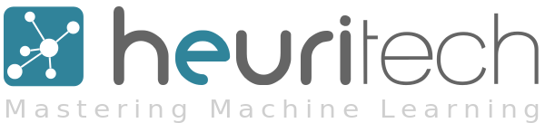
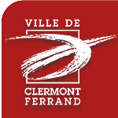
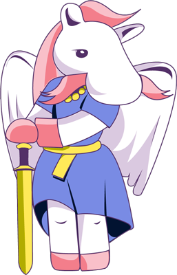
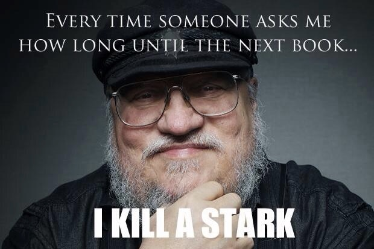

<!--
Titre : Introducing APIHours
Date : 16/14/2015
Événement : APIHour #14
Auteur : Julien Maupetit
-->

##### Clermont'ech fait son
# APIHour #14
### Freestyle Edition

### 16/04/2015 • Centre Jean Richepin

[@clermontech](https://twitter.com/clermontech)

[clermontech.org](http://clermontech.org)

`#APIHour`

clermontech(2)

----
<!-- ---------- Section ---------- -->
# Manifesto

---
# Partage

---
# Ouverture

Clermont'ech est technologie-agnostique.

---
# Indépendance

Clermont’ech ne se verra jamais dicter sa ligne éditoriale par des tiers extérieurs à l’association.

---
# Respect

    Crédit : <a href="http://thenounproject.com/noun/handshake/#icon-No767" target="_blank">Handshake</a> designed by <a href="http://thenounproject.com/Jake_Nelsen" target="_blank">Jake Nelsen</a> from The Noun Project

----
<!-- ---------- Section ---------- -->
# #APIHour

---
## #APIHour

* 4 talks
* 1h max.
* 50 personnes max.
* Lieu et jour variables
* Vidéos en ligne
* Fréquence : 6/8 semaines

---
## #APIHour
... is the new Happy Hour

    Crédit : <a href="http://thenounproject.com/noun/beer/#icon-No12254" target="_blank">Beer</a> designed by <a href="http://thenounproject.com/jacob" target="_blank">Jacob Halton</a> from The Noun Project

---
## #APIHour

Proposez nous un talk !

<a href="mailto:iwanttospeak@clermontech.org">iwanttospeak@clermontech.org</a>

<!-- ---------- Section ---------- -->
----
# Sponsors!

<table>
    <tr>
        <td>
            
        </td>
        <td>
            
        </td>
        <td>
            
        </td>
        <td>
            
        </td>
        <td>
            
        </td>
    </tr>
    <tr>
        <td></td>
        <td>
            
        </td>
        <td>
            
        </td>
        <td>
            
        </td>
        <td></td>
    </tr>
    <tr>
        <td>
            
        </td>
        <td>
            
        </td>
        <td>
            
        </td>
        <td>
            
        </td>
        <td>
            
        </td>
    </tr>
</table>

---
## Pour cet APIHour
### ♥ ♥ ♥

[http://heuritech.com](http://heuritech.com)

---
# Platydex

[http://github.com/clermontech/platydex](https://github.com/clermontech/platydex)

---
## Microcosme Clermontois

### [@LavaJUG](https://twitter.com/LavaJUG)

### [@ClermontJS](https://twitter.com/ClermontJS)

---
## Planet!

[planet.clermontech.org](http://planet.clermontech.org/)

---
# Merci !

### Mairie Clermont-Ferrand

<!-- ---------- Section ---------- -->
----

# Coming next.

---

# Code & Coffee
## 25 avril 2015 
### salon de thé/café Kissaten

---

# \#djangocong
## 8-10 Mai 2015 
### Clermont-Ferrand

[http://rencontres.django-fr.org/2015/](http://rencontres.django-fr.org/2015/)

<!-- ---------- Section ---------- -->
----
## Menu du jour

Web Sémantique
#### Cédric Klein

OpenStack
#### Frédéric Gaudet

AuvernIX, Je Suis Ton Peer
#### Denis Fondras

Le Machine Learning En Entreprise :  
Retour d'Expérience
#### Tony Pinville

<!-- ---------- Section ---------- -->
----
# Participez !

* Allez sur **app.wisembly.com** et entrez le mot-clé : **apihour14**

* Envoyez **apihour14** suivi de votre message au **31 035**

* Tweetez en utilisant **#APIHour14** ou **#APIHour** sur Twitter

* Participez par minitel sur `3615 WISEMBLY`

* Participez aussi Tam Tam ou Tatoo en appelant le `16 (1) + 42 25 00 01`

<!-- ---------- Section ---------- -->
----
# APIHour #15

## Summer edition

