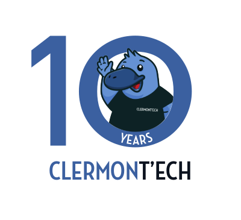
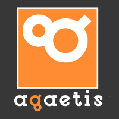
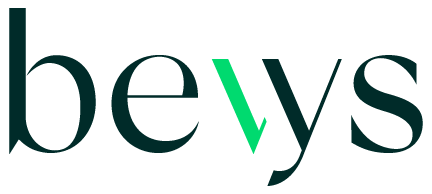
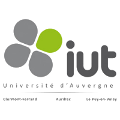
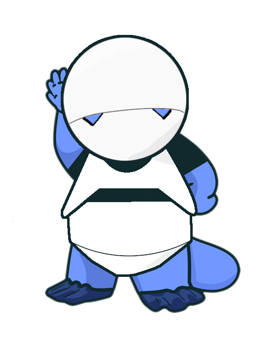

<!--
Titre : Introducing APIHours
Date : 12/11/2024
Événement : APIHour #62
-->

##### Clermont'ech fait son
# APIHour #62

#### 12/11/2024 • Simplon

[pialle.fr/@clermontech](https://piaille.fr/@clermontech)

[clermontech.org](http://clermontech.org)

[twitch.tv/clermontech](https://twitch.tv/clermontech)

[clermontech@googlegroups.com](https://groups.google.com/u/1/g/clermontech)

`#APIHour`

<!-- 

clermontech
 -->

----
<!-- ---------- Section ---------- -->
# Manifesto

---
# Partage

---
# Ouverture

Clermont'ech est technologie-agnostique.

---
# Indépendance

Clermont’ech ne se verra jamais dicter sa ligne éditoriale par des tiers extérieurs à l’association.

---
# Respect

    Crédit : <a href="http://thenounproject.com/noun/handshake/#icon-No767" target="_blank">Handshake</a> designed by <a href="http://thenounproject.com/Jake_Nelsen" target="_blank">Jake Nelsen</a> from The Noun Project

----
<!-- ---------- Section ---------- -->
# #APIHour

---
## #APIHour

* 3 talks aujourd'hui
* 1h30 max.
* 50 personnes max.
* Lieu et jour variables
* Vidéos en ligne sur Youtube
* Fréquence : 6/8 semaines
* Happy Hour !

---
## Ambassadeur

---
## #APIHour

Proposez-nous un talk !

<a href="mailto:iwanttospeak@clermontech.org">iwanttospeak@clermontech.org</a>

<a href="http://clermontech.org/api-hours/wishlist.html">Wishlist</a>

Mentoring !

<!-- ---------- Section ---------- -->
----
## Sponsors!

<table>
	<tr>
	    <td>
	        
	    </td>
	    <td>
	    </td>
	    <td>
	        
	    </td>
	</tr>
	<tr>
	    <td>
	        
	    </td>
	    <td>
	        
	    </td>
	    <td>
	        
	    </td>
	</tr>
	<tr>
	    <td>
            
	    </td>
	    <td>
	    </td>
	    <td>
	        
	    </td>
	</tr>
</table>

---
## Microcosme Clermontois

[@GTA](https://green-tech-auvergne.fr) 26/11

[@DataLover](https://www.meetup.com/fr-FR/cfdatalovers/) 11/12 

[@LavaJUG](https://twitter.com/LavaJUG) // [@MTGClermont](https://twitter.com/MTGClermont) // [@PyClermont](https://twitter.com/PyClermont) // [@VolcampIO](https://twitter.com/VolcampIO)

---

<table>
	<tr>
	<td>
        <h3>Planet 2.0</h3>
	</td>
	<td>
        <h3>Platydex</h3>
	</td>
	</tr>
	<tr>
	<td>
        
	</td>
	<td>
        
	</td>
	</tr>
	<tr>
	<td>
        [planet.clermontech.org](http://planet.clermontech.org/)
	</td>
	<td>
        [github.com/clermontech/platydex](https://github.com/clermontech/platydex)
	</td>
	</tr>
</table>

---
# Merci !

### Simplon

<!-- ---------- Section ---------- -->
----
## Menu du jour

(In)Sécurité du vote électronique • 30 min
#### Pascal Lafourcade

Simplifiez la gestion de vos environnements de développement avec devenv !
#### Loïc Bourg

RETEX-On a monté notre cluster docker swarm de version sans downtime
#### Florian Forestier

<!-- ---------- Section ---------- -->
----
# Participez !

* Tweetez en utilisant **#APIHour** sur ~~Twitter~~ Mastodon
* Rejoignez le chat sur Twitch: https://twitch.tv/clermontech
