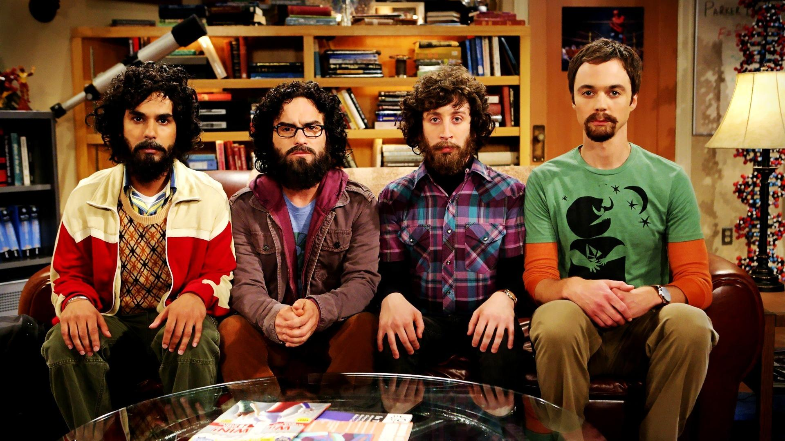

<!--
Titre : Introducing APIHours
Date : 16/12/2014
Événement : APIHour #12
Auteur : Julien Maupetit
-->

##### Clermont'ech fait son
# APIHour #12
### Xmas Edition

### 16/12/2014 • Eefficiency

[@clermontech](https://twitter.com/clermontech)

[clermontech.org](http://clermontech.org)

`#APIHour`

clermontech

----
<!-- ---------- Section ---------- -->
# Manifesto

---
# Partage

---
# Ouverture

Clermont'ech est technologie-agnostique.

---
# Indépendance

Clermont’ech ne se verra jamais dicter sa ligne éditoriale par des tiers extérieurs à l’association.

---
# Respect

    Crédit : <a href="http://thenounproject.com/noun/handshake/#icon-No767" target="_blank">Handshake</a> designed by <a href="http://thenounproject.com/Jake_Nelsen" target="_blank">Jake Nelsen</a> from The Noun Project

----
<!-- ---------- Section ---------- -->
# #APIHour

---
## #APIHour

* 4 talks
* 1h max.
* 50 personnes max.
* Lieu et jour variables
* Vidéos en ligne
* Fréquence : 6/8 semaines

---
## #APIHour
... is the new Happy Hour

    Crédit : <a href="http://thenounproject.com/noun/beer/#icon-No12254" target="_blank">Beer</a> designed by <a href="http://thenounproject.com/jacob" target="_blank">Jacob Halton</a> from The Noun Project

---
## #APIHour

Proposez nous un talk !

<a href="mailto:iwanttospeak@clermontech.org">iwanttospeak@clermontech.org</a>

---
## Be famous!

[@madmatah](https://twitter.com/madmatah) +300 vues sur YouTube en moins de 48h

<!-- ---------- Section ---------- -->
----
# Sponsors!

<table>
    <tr>
        <td>
            
        </td>
        <td>
            
        </td>
        <td>
            
        </td>
        <td>
            
        </td>
        <td>
            
        </td>
    </tr>
    <tr>
        <td>
            
        </td>
        <td>
            
        </td>
        <td>
            
        </td>
        <td>
            
        </td>
        <td>
            
        </td>
    </tr>
    <tr>
        <td></td>
        <td>
            
        </td>
        <td>
            
        </td>
        <td>
            
        </td>
        <td></td>
    </tr>
</table>

---
### Boutique spreadshirt

[http://clermontech.spreadshirt.fr](http://clermontech.spreadshirt.fr)

### Boutique stickermule

[http://www.stickermule.com/user/1070074800/stickers](http://www.stickermule.com/user/1070074800/stickers)

---
# Platydex

[http://github.com/clermontech/platydex](https://github.com/clermontech/platydex)

---
# APIHour contest
### T-Shirt

La 42ème conso tu prendras !

# 42
## 42
### 42

---
## Microcosme Clermontois

### [@LavaJUG](https://twitter.com/LavaJUG)

### [@ClermontJS](https://twitter.com/ClermontJS)

---
## Planet!

[planet.clermontech.org](http://planet.clermontech.org/)

---
# Merci !

### T. Colombet (Eefficiency)

<!-- ---------- Section ---------- -->
----
## Menu du jour

Le Bon Stop
#### David Valéry

Sigfox Le Champion Français Des Objets Connectés
#### Paul Pinault

La PSSI De La Nation
#### Vincent Mazenod

Docker, Ceci N'Est Pas Une Introduction
#### William Durand

<!-- ---------- Section ---------- -->
----
# Participez !

* Allez sur **app.wisembly.com** et entrez le mot-clé : **apihour12**

* Envoyez **apihour12** suivi de votre message au **31 035**

* Tweetez en utilisant **#APIHour12** ou **#APIHour** sur Twitter

* Participez par minitel sur `3615 WISEMBLY`

<!-- ---------- Section ---------- -->
----
# APIHour #13

## Birthday Edition

