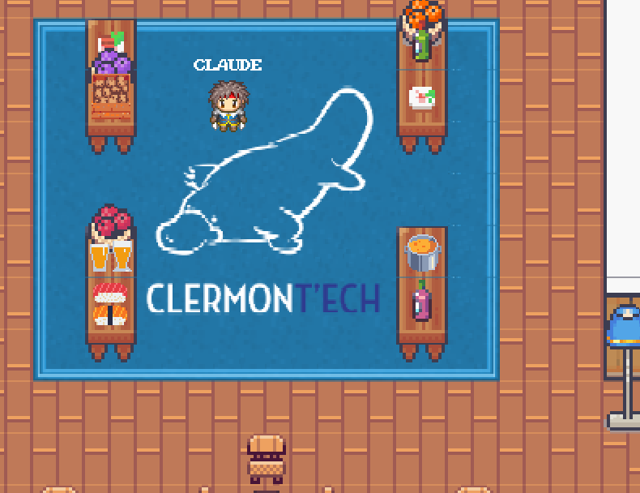

<!--
Titre : Introducing APIHours
Date : 11/03/2021
Événement : APIHour #47
-->

##### Clermont'ech fait son
# APIHour #47

#### 11/03/2021 • Twitch

[@clermontech](https://twitter.com/clermontech)

[clermontech.org](http://clermontech.org)

`#APIHour`

<!-- 

clermontech
 -->

----
<!-- ---------- Section ---------- -->
# Manifesto

---
# Partage

---
# Ouverture

Clermont'ech est technologie-agnostique.

---
# Indépendance

Clermont’ech ne se verra jamais dicter sa ligne éditoriale par des tiers extérieurs à l’association.

---
# Respect

    Crédit : <a href="http://thenounproject.com/noun/handshake/#icon-No767" target="_blank">Handshake</a> designed by <a href="http://thenounproject.com/Jake_Nelsen" target="_blank">Jake Nelsen</a> from The Noun Project

----
<!-- ---------- Section ---------- -->
# #APIHour

---
## #APIHour

* 4 talks aujourd'hui
* 1h30 max.
* 50 personnes max.
* Jour variables
* Vidéos en ligne sur Youtube
* Fréquence : 6/8 semaines 
* Happy Hour distanciel !

---
## Ambassadeurs

---
## #APIHour

Proposez-nous un talk !

<a href="mailto:iwanttospeak@clermontech.org">iwanttospeak@clermontech.org</a>

<a href="http://clermontech.org/api-hours/wishlist.html">Wishlist</a>

Mentoring !

<!-- ---------- Section ---------- -->
----
## Sponsors!

<table>
	<tr>
	    <td>
	        
	    </td>
	    <td colspan="3">
	        
	    </td>
	    <td>
	        
	    </td>
	</tr>
	<tr>
	    <td>
	        
	    </td>
	    <td colspan="3">
	        
	    </td>
	    <td>
	        
	    </td>
	</tr>
    <tr>
        <td>
            
        </td>
        <td colspan="3">
        </td>
        <td>
	        
        </td>
    </tr>
	<tr>
	    <td>
            
	    </td>
	    <td colspan="3">
	        
	    </td>
	    <td>
	        
	    </td>
	</tr>
</table>

---
<table>
	<tr>
	<td>
        <h3>Planet</h3>
	</td>
	<td>
        <h3>Platydex</h3>
	</td>
	</tr>
	<tr>
	<td>
        
	</td>
	<td>
        
	</td>
	</tr>
	<tr>
	<td>
        [planet.clermontech.org](http://planet.clermontech.org/)
	</td>
	<td>
        [github.com/clermontech/platydex](https://github.com/clermontech/platydex)
	</td>
	</tr>
</table>
<!-- ---------- Section ---------- -->
----
## Menu du jour

Mission Cryptographie
#### Pascal Lafourcade

Helium
#### Paul Pinault

LiveCoding avec FastAPI
#### Paul Amar

Alpine c’est cool
#### Sylvain Desgrais 

<!-- ---------- Section ---------- -->
----
# Participez !

* Posez vos questions dans le chat de Twitch
* Tweetez en utilisant **#APIHour47** ou **#APIHour** sur Twitter

<!-- ---------- Section ---------- -->
----
# WorkAdventure

wa.clermontech.org