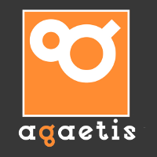

<!--
Titre : Introducing APIHours
Date : 15/09/2016
Événement : APIHour #22
-->

##### Clermont'ech fait son
# APIHour #22

#### 15/09/2016 • Le Celtill

[@clermontech](https://twitter.com/clermontech)

[clermontech.org](http://clermontech.org)

`#APIHour`

clermontech(2)

----
<!-- ---------- Section ---------- -->
# Manifesto

---
# Partage

---
# Ouverture

Clermont'ech est technologie-agnostique.

---
# Indépendance

Clermont’ech ne se verra jamais dicter sa ligne éditoriale par des tiers extérieurs à l’association.

---
# Respect

    Crédit : <a href="http://thenounproject.com/noun/handshake/#icon-No767" target="_blank">Handshake</a> designed by <a href="http://thenounproject.com/Jake_Nelsen" target="_blank">Jake Nelsen</a> from The Noun Project

----
<!-- ---------- Section ---------- -->
# #APIHour

---
## #APIHour

* ~~4 talks~~ 3 talks aujourd'hui
* 1h max.
* 50 personnes max.
* Lieu et jour variables
* Vidéos en ligne
* Fréquence : 6/8 semaines
* Happy Hour !

---
## #APIHour

Proposez-nous un talk !

<a href="mailto:iwanttospeak@clermontech.org">iwanttospeak@clermontech.org</a>

---

## Questionnaire

[https://clermontech.typeform.com/to/tOv7KJ](https://clermontech.typeform.com/to/tOv7KJ)

<!-- ---------- Section ---------- -->
----
# Sponsors!

<table>
	<tr>
	<td>
	
	</td>
	<td colspan="3">
	
	</td>
	<td>
	
	</td>
	</tr>
	<tr>
	<td>
	
	</td>
	<td colspan="2">
	
	</td>
	<td>
	
	</td>
	<td>
	
	</td>
	</tr>
	<tr>
	<td>
	
	</td>
	<td colspan="2">
	
	</td>
	<td>
	
	</td>
	<td>
	
	</td>
	</tr>
</table>

---
## Domraider

---
<table>
	<tr>
	<td>
        <h3>Planet</h3>
	</td>
	<td>
        <h3>Platydex</h3>
	</td>
	</tr>
	<tr>
	<td>
        
	</td>
	<td>
        
	</td>
	</tr>
	<tr>
	<td>
        [planet.clermontech.org](http://planet.clermontech.org/)
	</td>
	<td>
        [github.com/clermontech/platydex](https://github.com/clermontech/platydex)
	</td>
	</tr>
</table>

---
### Microcosme Clermontois

# Sigfox maker tour

6 Octobre / Le Bivouac

[makers.sigfox.com/tour/register/](http://makers.sigfox.com/tour/register/)

---
# Merci !

### James

<!-- ---------- Section ---------- -->
----
## Menu du jour

Adopte une BDD <small>(30 min)</small>
#### Aymeric Brisse

rethinkDB
#### Etienne Roudeix

Redis
#### Claude Dioudonnat

<!-- ---------- Section ---------- -->
----
# Participez !

* Allez sur **app.wisembly.com** et entrez le mot-clé : **apihour22**

* Envoyez **apihour22** suivi de votre message au **31 035**

* Tweetez en utilisant **#APIHour22** ou **#APIHour** sur Twitter

* Participez par minitel sur `3615 WISEMBLY`

* Participez aussi Tam Tam ou Tatoo en appelant le `16 (1) + 42 25 00 01`

<!-- ---------- Section ---------- -->
----
## APIHour #23

// TODO
